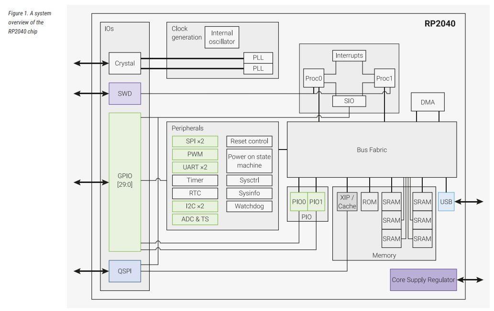
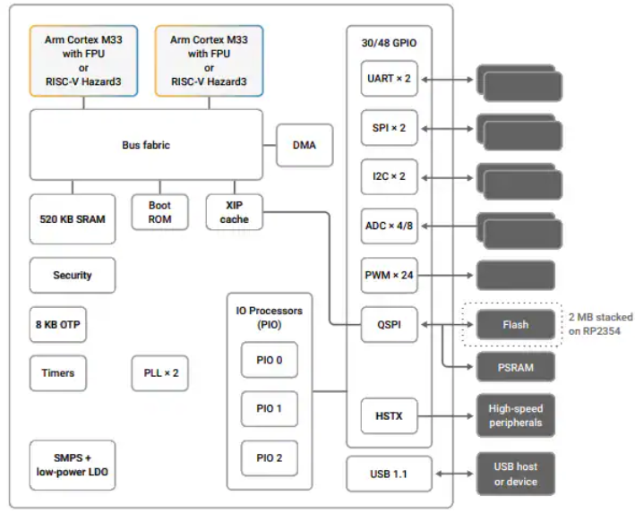

# pico-assembly

# Microcontrôleurs Raspberry Pi : RP2040 et RP2350

[Voir le jeu d'instructions ARM](instructionSet.md)


## RP2040

Le **RP2040** est le premier microcontrôleur conçu par Raspberry Pi, introduit en 2021. Il est notamment utilisé dans la carte Raspberry Pi Pico.

# Aperçu du RP2040



> Figure : Schéma des principales caractéristiques et périphériques du microcontrôleur RP2040.


### Caractéristiques principales

- **CPU** : Double cœur ARM Cortex-M0+ (jusqu’à 133 MHz)
- **Mémoire SRAM** : 264 Ko
- **Mémoire Flash** : Externe (QSPI, typiquement 2 Mo ou plus selon la carte)
- **GPIO** : 30 broches multifonctions
- **Interfaces** :
  - 2 × UART
  - 2 × SPI
  - 2 × I2C
  - USB 1.1 (device ou host)
- **Périphériques spéciaux** :
  - **PIO (Programmable I/O)** : 2 blocs PIO, chacun contenant 4 machines d’état (soit 8 machines d’état au total)
  - Timer et PWM
- **ADC** : 12 bits (4 entrées + capteur température interne)
- **Fabrication** : Gravure en 40 nm
- **Consommation** : Faible, adapté aux systèmes embarqués

### Points forts

- Très flexible grâce aux blocs **PIO**
- Coût très bas
- Large support logiciel (C/C++ SDK, MicroPython, etc.)

---

# Microcontrôleur RP2350

Le **RP2350** est un microcontrôleur récent de Raspberry Pi, conçu pour offrir des performances élevées et des fonctionnalités de sécurité avancées.

# Aperçu du RP2350



> Figure : Schéma des principales caractéristiques et périphériques du microcontrôleur RP2350.

## 1. Processeur

- **CPU** : Dual ARM Cortex-M33 ou dual Hazard3 RISC-V
- **Fréquence maximale** : 150 MHz

## 2. Mémoire

- **SRAM intégrée** : 520 Ko, répartie en 10 banques indépendantes
- **Mémoire externe** : support jusqu’à 16 Mo de Flash/PSRAM via bus QSPI dédié
- **Extension** : 16 Mo supplémentaires accessibles via un second chip-select optionnel

## 3. Périphériques

- **UART** : 2
- **SPI** : 2 contrôleurs
- **I2C** : 2 contrôleurs
- **PWM** : 24 canaux
- **ADC** : 4 ou 8 canaux
- **USB** : 1 contrôleur USB 1.1 + PHY, support hôte et device
- **PIO (Programmable I/O)** : 12 machines d’état au total

## 4. Sécurité

- Signature optionnelle du boot enforceée par le mask ROM, avec empreinte de clé dans l’OTP
- Stockage OTP protégé pour clé de déchiffrement de boot optionnelle
- Filtrage global des bus selon niveaux de sécurité/privilege (ARM ou RISC-V)
- Assignation individuelle des périphériques, GPIO et canaux DMA aux domaines de sécurité
- Mitigations matérielles contre les attaques par injection de faute
- Accélérateur matériel SHA-256

## 5. Points forts

- Performances accrues par rapport au RP2040
- Sécurité matérielle avancée pour applications critiques
- Flexibilité élevée grâce aux PIO et à la gestion fine des DMA et périphériques
- Support possible pour des architectures dual-core ARM ou RISC-V


---

## Comparaison rapide

| Caractéristique | RP2040 | RP2350 |
|----------------|--------|--------|
| CPU | 2× Cortex-M0+ | Cortex-M33 / RISC-V |
| Fréquence | ~133 MHz | Plus élevée |
| SRAM | 264 Ko | Supérieure |
| PIO | Oui | Amélioré |
| Sécurité | Basique | Avancée (TrustZone) |
| Usage typique | Projets embarqués simples à intermédiaires | Projets avancés / industriels |


# Installation de l'environnement pour Raspberry Pi Pico

## 1. Installer les outils nécessaires

```bash
sudo apt update
sudo apt install cmake gcc-arm-none-eabi build-essential git
```

## 2. Installer le SDK officiel du Pico

```bash
cd ~
git clone https://github.com/raspberrypi/pico-sdk.git
```

## 3. Initialiser les dépendances (IMPORTANT)

```bash
cd pico-sdk
git submodule update --init
```

## 4. Définir la variable d’environnement

Ouvrir le fichier :

```bash
nano ~/.bashrc
```

Ajouter la ligne suivante :

```bash
export PICO_SDK_PATH=~/pico-sdk
```

Appliquer les modifications :

```bash
source ~/.bashrc
```

Vérifier :

```bash
echo $PICO_SDK_PATH
```
---

# Compiler un projet Raspberry Pi Pico

## 1. Préparer le projet

Dans le répertoire du projet :

Créer ou modifier le fichier :

```bash
nano pico_sdk_import.cmake
```

Ajouter la ligne suivante :

```cmake
include($ENV{PICO_SDK_PATH}/external/pico_sdk_import.cmake)
```

Sauvegarder le fichier.

## 2. Structure minimale du projet

Le projet doit contenir :

- `CMakeLists.txt`
- `main.S`
- `pico_sdk_import.cmake`

## 3. Compiler le projet

```bash
mkdir build
cd build
cmake ..
make
```

## 4. Compiler en mode debug

```bash
rm -rf build
mkdir build
cd build
cmake -DCMAKE_BUILD_TYPE=Debug ..
make
```
---

# Installation de OpenOCD et GDB pour Raspberry Pi Pico

## 1. Installer les dépendances

```bash
sudo apt install libjim-dev pkg-config
sudo apt install libhidapi-dev libusb-1.0-0-dev
sudo apt install gdb-multiarch
```

## 2. Installer OpenOCD (version Raspberry Pi)

```bash
cd pico-sdk/
git clone https://github.com/raspberrypi/openocd.git
cd openocd
git submodule update --init --recursive
./bootstrap
./configure --enable-internal-jimtcl
make -j$(nproc)
sudo make install
```

## 3. Configurer les règles udev

Créer le fichier :

```bash
sudo nano /etc/udev/rules.d/99-picoprobe.rules
```

Ajouter la ligne suivante :

```bash
SUBSYSTEM=="usb", ATTR{idVendor}=="2e8a", MODE="0666"
```

Recharger les règles :

```bash
sudo udevadm control --reload-rules
sudo udevadm trigger
```

## 4. Tester OpenOCD

```bash
sudo openocd -f interface/cmsis-dap.cfg -f target/rp2040.cfg -c "adapter speed 5000"
```

---


